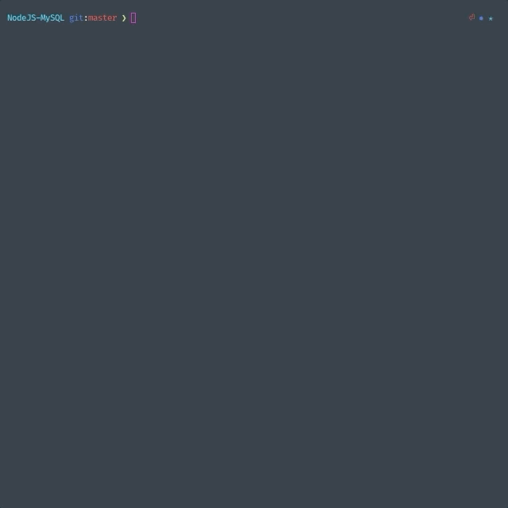
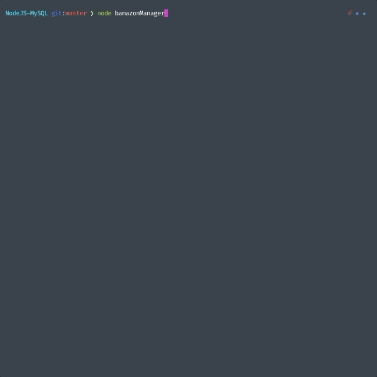

# NodeJS + MySQL = Bamazon!
A command line way to shop for goods/items. This project uses Node.js to faciliate user interaction and MySQL as the backend.

## Prerequisites
- Node.js
- MySQL

## Installation
- After downloading/cloning this project, run `npm install`
- Refer to `schema.sql` for database structure. `sample_data.sql` is included to get started with mock data

## Usage
### node bamazonCustomer
🤔 Check out and see what happens if you buy more than the stock quantity listed per item!

***
### node bamazonManager

#### View Products for Sale
This command will list all the products that's stored in the database

#### View Low Inventory
This command will query items that have a stock quantity fewer than 5

#### Update Inventory 
This command will allow the manager to update the stock quantity of an item

#### Add New Product
This command will ask the manager a series of prompts to add a new item to the inventory

***
### Notable npm packages
- `cli-table` is used to make the tables "pretty": [https://www.npmjs.com/package/cli-table]
- `inquirer` is used as a helper for the interactive command line user interface: [https://www.npmjs.com/package/inquirer]

### Future Developments
- __Validate Entries:__ e.g. A `SKU` should only be able to take an integer, limit/scope `Department` from a stored array, etc...
- __Supervisor View:__ A third command/view to see projections/profits of the store